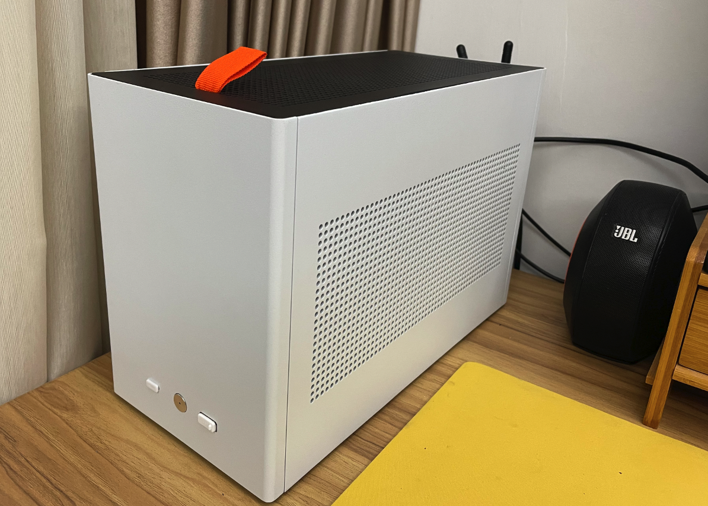
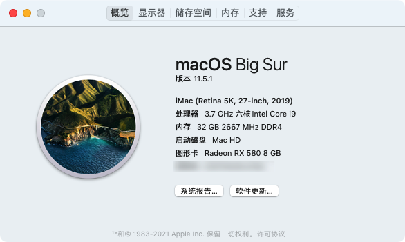
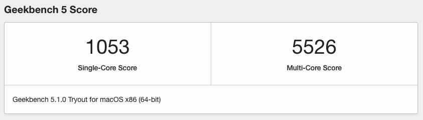
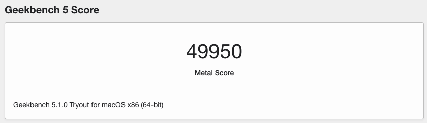

# ASRock Z390m-itx/ac i5-9600k RX580 OC

## 硬件清单

- i5-9600k
- ASRock Z390m-itx/ac
- BCM94360CS2 网卡
- AMD RX580 2304sp
- 金士顿骇客神条DDR4 2666MHZ 16G * 2
- 海康威视C2000PRO 1T
- 利民AXP-90/R FULL 115X版本 (换了小机箱，装不了一体水冷，效果不如之前的ID Cooling一体水冷)
- SGPC傻瓜超人K49PRO机箱 (原SGPC K99)
- ID Cooling 12015 4pin * 2 机箱风扇

## MacOS版本

macOS 11.5.1 (Build 20G80)

## OpenCore版本

[0.7.3](https://github.com/acidanthera/OpenCorePkg/releases/tag/0.7.3)

## BIOS设置

- Primary Graphics Adapter -> PCI Express
- CFG Lock -> Disabled
- IGPU Multi-Monitor -> Enabled
- XHCI Hand-off -> Enabled
- Secure Boot -> Disabled
- CSM -> UEFI Only (我的BIOS设置里没有找到disable的选项，将里面三个选项都选择UEFI Only)
- Above 4G Decoding -> Disable (这个不使用双显卡的情况下必须关闭, 不然和 CSM 设置冲突, 造成 Windows 无法启动)

## 跑分

